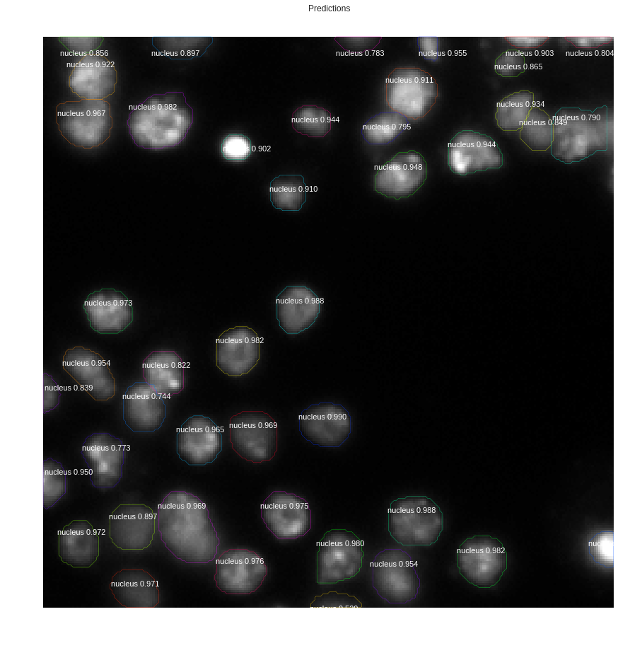

# Trained the Mask RCNN model on given nuclei dataset

## Approach

I trained the Mask RCNN model (matterport implementation) on the given nuclei dataset.

The model is pre-built and is provided in their [github repository](https://github.com/matterport/Mask_RCNN)

Steps:
i. Configured the model for training it on the given dataset and also prepared the dataset loading.
All this was to be done by inheriting the respective model classes.
1. Inherited *Config* class for configuring the model according to the requirement.
2. Inherited *Dataset* class for loading the dataset.

ii. Then training was done for the model. There was a need of using pre-training as the provided dataset is not very large. Hence i used the pre-trained weights of the model on MS COCO dataset and they were provided for downloading automatically in the matterport implementation.

iii. Then the model was fine-tuned on the given dataset of nuclei and the weights were saved in the model directory. (I have not included the trained weights in the submission)

iv. Then the testing was done on the test dataset. The sample output from the the model for one of the test image is as follows:

v. The mean average precision is then calculated on the 50 images from the training set.

### Notes:
1. The model was trained on Google Colab
2. The notebook.pynb contains code for training model on Google Colab
3. The trained weights are not included in the folder.
4. The dataset is not included in the directory